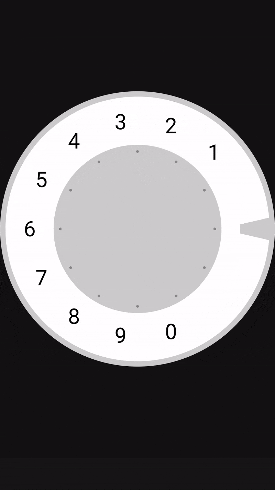

# Rotary Phone Dial Animation

A Jetpack Compose implementation of a classic rotary phone dial with realistic mechanical behavior and visual feedback. This component provides an authentic vintage phone experience with proper rotation constraints and smooth animations.

## Overview

This project recreates the iconic rotary dial mechanism found in vintage telephones. It features:

- ✨ Realistic rotation mechanics
- 🔄 Smooth animations
- 🎯 Accurate digit selection
- 🔒 Mechanical constraints
- 🎨 Authentic visual design

## Demo



## Implementation Highlights

The component is built entirely with Jetpack Compose and features:

- Custom gesture handling for rotation
- Physical constraints matching real rotary phones
- Smooth animations powered by `animateFloatAsState`
- Vector-based rendering using Compose Canvas
- Accurate hit detection for digits

## Usage

Add the component to your Compose UI:

```kotlin
@Composable
fun YourScreen() {
    OldPhone(
        modifier = Modifier.padding(16.dp)
    )
}
```

## Technical Details

### Key Features

- Individual digit areas with proper hit detection
- Rotation limit calculated per digit (27° segments)
- Spring-back animation on release
- Visual feedback for selected digits
- Mechanical stopper element at 0°

### Implementation Details

The dial is implemented using:
- Compose Canvas for drawing
- Custom pointer input handling
- State management for rotation
- Animated state transitions

## Article

For a detailed explanation of the implementation (in Russian), check out the article on Habr: https://habr.com/ru/articles/871956/

## License

[LICENSE](LICENSE)